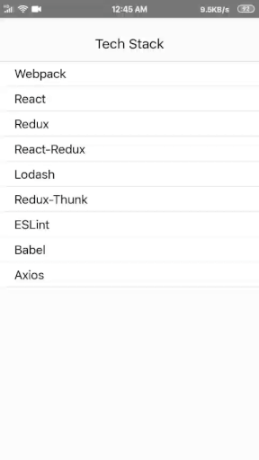

# React-Native Tech-Stack

An app built with Vanilla React Native and Redux to display tech stack in Javascript.
This app uses Redux for actions generated by the components.
Also the app uses a lot of reusable components that can be used in other projects, feel free to use or contribute more.

## Installation

Clone the repo, setup react-native CLI via npm & run using
```bash
react-native run-android
```

## Working



## Contributing
Pull requests are welcome. For major changes, please open an issue first to discuss what you would like to change.

